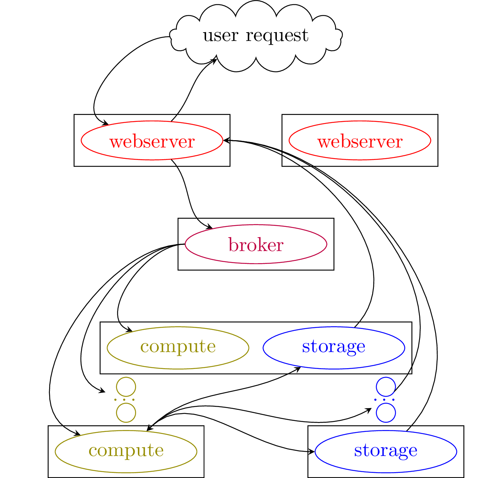
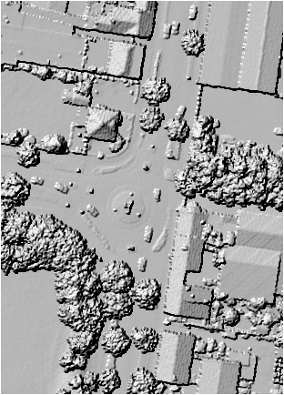
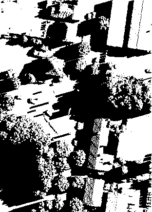
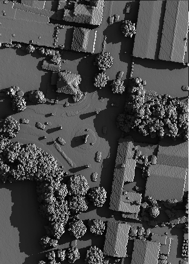
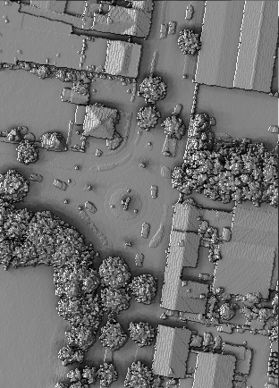

# PV-GRIP (PV-Geographic Raster Image Processor)

[](http://www.youtube.com/watch?v=GGpmm5at-a8)

PV-GRIP is a distributed service that provides access to geospatial
data and performs various computations relevant to photovoltaics (PV).

PV-GRIP originated as a fork of the
[open-elevation](https://github.com/Jorl17/open-elevation)
project. However, unlike the open-elevation, PV-GRIP features
distributed computation and storage design, handles multiple data
types and performs several PV simulations.

## Distributed service design

The PV-GRIP consists of several components: webserver nodes
([bottle](https://bottlepy.org/docs/dev/)), compute nodes
([celery](https://docs.celeryproject.org/en/stable/)), storage nodes
([cassandra](https://cassandra.apache.org/) and/or
[ipfs](https://ipfs.io/)), message broker
([redis](https://redis.io/)).

The following figure demonstrates the interaction of those components.



The webserver listens to the user requests, starts tasks and serves
results. The message broker assigns tasks among compute nodes and
collects tasks' results. Furthermore, the broker implements the
inter-node locking mechanism and a hash table containing records on
the current user queries. The compute nodes execute various tasks. The
storage nodes handle data exchange between the nodes and implements
the spatial index.

PV-GRIP can be run on a single computer or multiple machines.

Below are provided examples and deployment instructions.

## Examples

Here we assume that a machine has access to the webserver running on
`10.0.0.1`.

The server timeout is 10 seconds. In this time, it either responds
with a binary file or a json dictionary.

In case the task is being executed, the following message is returned:
```
{"message": "task is running"}
```

### Query help

On a node with access to the webserver
```
> curl 10.0.0.1:8080/api/help | jq -r .results
```
to see all available commands.

To query help on any particular command call
```
> curl 10.0.0.1:8080/api/help/raster | jq -r .results
```

### Sample raster images

```
> curl 10.0.0.1:8080/api/raster
```
samples data from several data sources and produces a required output.

`box` argument defines area location in the format
`'[min_latitude,min_longitude,max_latitude,max_longitude]'`. `step`
defines pixel size (in meters by default).

For example,
```
> curl 10.0.0.1:8080/api/raster\?box='\[50.85910,6.07627,50.86033,6.07767\]'\&output_type='pnghillshade'\&data_re='.*NRW_Las.*'\&stat='max'\&step=0.5 -o kerkrade.png
```
produces



### Compute shadows

```
> curl 10.0.0.1:8080/api/shadow
```
computes binary mask for shadow locations.

For example,
```
> curl 10.0.0.1:8080/api/shadow\?box='\[50.85910,6.07627,50.86033,6.07767\]'\&output_type='png'\&data_re='.*NRW_Las.*'\&stat='max'\&step=0.5\&timestr='2020-07-01_06:00:00 -o kerkrade_shadow.png
```
produces



### Compute irradiance

```
> curl 10.0.0.1:8080/api/irradiance
```
computes irradiance raster map for a time and given atmospheric GHI
and DHI values.

For example,
```
> curl 10.0.0.1:8080/api/irradiance\?box='\[50.85910,6.07627,50.86033,6.07767\]'\&output_type='pngnormalize'\&data_re='.*NRW_Las.*'\&stat='max'\&step=0.5\&ghi=500\&dhi=200\&timestr='2020-07-01_06:00:00 -o kerkrade_irr.png
```
produces



### Compute integrated irradiance

```
> curl 10.0.0.1:8080/api/integrate
```
computes integrated irradiance over a period of time, provided `GHI`,
`DHI` and timestamp.

To integrate irradiance over a certain period of time an additional
file has to be supplied, where `GHI`, `DHI` and `timestr` are
provided.
```
> cat > data.tsv
"ghi" "dhi" "timestr"
0 0 "2015-06-03_02:45:00"
0 0 "2015-06-03_02:50:00"
...

> curl -F data=@data.tsv 10.0.0.1:8080/api/upload
{"storage_fn": "ipfs_path:///code/data/results_cache/upload_a5e9a7bf6c5b1ea95fa337b2655a0f55"}
> curl 10.0.0.1:8080/api/integrate\?box='\[50.85910,6.07627,50.86033,6.07767\]'\&output_type='pngnormalize'\&data_re='.*NRW_Las.*'\&stat='max'\&step=0.5\&tsvfn_uploaded="ipfs_path:///code/data/results_cache/upload_a5e9a7bf6c5b1ea95fa337b2655a0f55" -o kerkrade_int.png
```

produces



### Computation along a route

```
> curl 10.0.0.1:8080/api/route
```
performs computations of effective irradiance along a given route.

For the route computation, `box` (e.g. `'[-50,-50,50,50]'`) parameter
specifies the minimum distance allowed from every observation point in
the route to the edge of the sampled data (in meters). `box_delta`
defines the maximum allowed box.

To compute route, a series of regions are sampled to cover every point
along a route. Then, the effective irradiance is computed using the
sampled topographical data.

For example,
```
> cat > route.tsv
latitude longitude timestr dhi ghi
50.8668 6.49331 2019-12-02_11:16:18 138.486 166.368
50.8668 6.49331 2019-12-02_11:16:20 138.486 166.368
...

> curl -F data=@route.tsv 10.0.0.1:8080/api/upload
{"storage_fn": "ipfs_path:///code/data/results_cache/upload_7eecd21d53dd5e42aa9cf2041cca2102"}
> curl 10.0.0.1:8080/api/route\?tsvfn_uploaded="ipfs_path:///code/data/results_cache/upload_7eecd21d53dd5e42aa9cf2041cca2102"\&data_re=".*_Las.*"\&step=0.5 -o route_effective_GHI.tsv
> cat route_effective_GHI.tsv
latitude longitude timestr dhi ghi POA
50.8668 6.49331 2019-12-02_11:16:18 138.486 166.368 122.815861595034
50.8668 6.49331 2019-12-02_11:16:20 138.486 166.368 122.819899972226
...

```

### Querying weather

```
> curl 10.0.0.1:8080/api/weather
```
queries various weather related parameters.

The weather data is queried from the
[copernicus](https://ads.atmosphere.copernicus.eu/) data bank. For
that one needs to register, obtain [API
keys](https://ads.atmosphere.copernicus.eu/api-how-to), and set the in the `config/pvgrip.conf`
```
...
[copernicus]
cds_url = https://cds.climate.copernicus.eu/api/v2
ads_url = https://ads.atmosphere.copernicus.eu/api/v2
cds_key = {UID}:{API_key}
ads_key = {UID}:{API_key}
hash_length = 6
...
```

The spatial resolution of the copernicus data is about 4x4 km^2, hence
the data to query is assigned to different regions defined by its
geohash. `hash_length = 6` results in approximately 1x1 km^2 regions.

#### Querying irradiance data

Irradiance values can be queried using `/weather/irradiance/route` and
`/weather/irradiance/box`.

For example,
```
> curl 10.0.0.1:8080/api/weather/irradiance/route\?tsvfn_uploaded='ipfs_path:///code/data/results_cache/upload_...'
latitude longitude timestr region_hash GHI DHI
50.9048 6.40418 2019-12-02_11:00:50 127.728 174.786 u1h99d 170.766 130.254
50.9048 6.40417 2019-12-02_11:00:52 127.728 174.786 u1h99d 170.766 130.254
...
```
queries irradiance values along a given route.

```
> curl 10.0.0.1:8080/api/weather/irradiance/box\?time_step='2minutes'\&box='\[50.865,7.119,50.867,7.121\]'
region_hash timestr region_latitude region_longitude GHI DHI
u1j13g 2019-07-01_10:00:00 50.86395263671875 7.1136474609375 830.28  146.592
u1j13g 2019-07-01_10:02:00 50.86395263671875 7.1136474609375 832.572 147.0
...
```
queries irradiance values in a given box.

See `/api/help/weather/irradiance` for a list of values that can be
queried.

#### Querying reanalysis data

Various reanalysis values from ERA5-Land can be queries using
`/weather/reanalysis/route` and `/weather/reanalysis/box`.

For example
```
> curl 10.0.0.1:8080/api/weather/reanalysis/box\?time_step='2minutes'\&box='\[50.865,7.119,50.867,7.121\]'
region_hash sample_hash timestr latitude longitude 10m_u_component_of_wind 10m_v_component_of_wind 2m_temperature
u1j u1j13u 2019-07-01_10:00:00 50.86944580078125 7.1136474609375 4.211197058849415 -0.9137861066780429 295.89421226672954
u1j u1j13u 2019-07-01_10:02:00 50.86944580078125 7.1136474609375 4.211197058849415 -0.9137861066780429 295.89421226672954
...
```
queries irradiance values in a given box.

[CDS Climate
Data](https://cds.climate.copernicus.eu/cdsapp#!/dataset/reanalysis-era5-land?tab=overview)
provides a list of possible values that can be queried.

### Type of output

The `serve_type` parameter in almost every query type instructs the
webserver to return data in different formats.

  - `serve_type=file` (default) transmits a file

  - `serve_type=path` sends back a pvgrip path (similar to `/upload` output)

  - `serve_type=ipfs_cid` sends back a ipfs_cid that can be downloaded
    with ipfs.  or viewed on a public service like
    `https://ipfs.io/ipfs/Q...`

## Deployment

The following subsection describe steps to deploy PVGRIP.

### Requirements

To run the PV-GRIP, each node should have a docker installed, with
user privileges to run docker images (optionally, user privileges to
set up network interfaces). Further, scripts below assume that tools
`curl`, `awk`, `jq`, `bc` are present on the system.

### Submodules

PV-GRIP consists of several submodules. Make sure to clone all of
them:
```
git clone git@github.com:esovetkin/open-elevation.git
cd open-elevation
git submodule update --init --recursive
```

### Setting up network

It is recommended to set up a [Wireguard](https://www.wireguard.com/)
network for communications between storage/worker nodes. For our setup
we utilise [innernet](https://github.com/tonarino/innernet).

Below it is assumed that each node has a network interface `pvgrip`
set up, such that each node can reach another one within this
network. Further, we assume that the `node1` has an ip address
`10.0.0.1`, whereas the `node2` has an ip address `10.0.0.2`, etc.

### Setting up cassandra storage

To start the first cassandra node on the `node1` say
```
cd pvgrip/storage/cassandra_io
./scripts/start_cassandra.sh --broadcast=10.0.0.1
```

Several arguments can be specified, e.g. mount point `--mnt` where the
actual data resides, used `--max_heap_size` for the maximum RAM being
allocated for cassandra. See more info using
```
cd pvgrip/storage/cassandra_io
./scripts/start_cassandra.sh --help
```

Before starting a second cassandra node, wait till the start up on
`node1` is over. Check if the startup is complete by saying
```
docker logs cassandra_storage | grep 'Startup complete'
```

To start the second cassandra node on the `node2` say
```
cd pvgrip/storage/cassandra_io
./scripts/start_cassandra.sh --broadcast=10.0.0.2 --seed=10.0.0.1
```

### Setting up ipfs storage

IPFS storage consists of IPFS daemon, and IPFS-cluster. See [ipfs_io
REAMDE](https://github.com/IEK-5/ipfs_io#readme) for more details.

When all `pvgrip/storage/ipfs_io/secret` are set up, it is sufficient
to say
```
cd pvgrip/storage/ipfs_io
./ipfs_io.sh
```

See further arguments in
```
./ipfs_io.sh --help
```

### Building/Getting PV-GRIP images

Before starting with worker/webserver nodes a docker image should be
present. To build the docker image say
```
./pvgrip.sh --what=build
```

Alternatively, a docker image can be pulled from the docker image
repository:
```
docker pull esovetkin/pvgrip:latest
```

### Setting up a worker/webserver node


A series of configuration parameters should be set up in the
`configs/pvgrip.conf` file depending your network configuration.

The following specifies address of one of the cassandra nodes
```
[cassandra]
ip = 10.0.0.2
```
as well as the address of the message broker node
```
[redis]
ip = 10.0.0.1
```

The following line sets the interface where the webserver and message
broker ports are binding:
```
[server]
interface = pvgrip
```

The following line
```
./pvgrip.sh --what=webserver
```
starts the webserver,
```
./pvgrip.sh --what=broker
```
starts the broker, and
```
./pvgrip.sh --what=worker
```
starts a processing node.

## Data

The server utilises [Cassandra](https://cassandra.apache.org/) and
[IPFS](https://ipfs.io/) that stores distributed data and spatial
index.

### Uploading data

Unlike the original project multiple sources of data can be used. If
multiple data sources are available for a given query, a dataset with
higher resolution is selected.

To make some data available for a webserver it is needed to be
uploaded. The data can be a collection of geotiff raster files (in
arbitrary coordinate system) or a directory containing
`remote_meta.json` file, specifying required information needed to
query remote data.

To upload a new data, it should be placed as a subdirectory of the
`data/current` directory. To upload data say
```
./scripts/upload_data.py data/current/<new data>
```
This will build an index and upload necessary data to the cassandra
storage.

```
./scripts/upload_data.py data/current/
```
will process all data placed in the `data/current` directory.

All data should be placed in `data/current` directory.

### Templates for remote data

`templates` directory contains examples of the `remote_meta.json`
files defining the location of several data sources.

### Preprocessing raster files

Say
```
scripts/preprocess.sh
```
to preprocess data. That command converts splits files on smaller
chunks (maximum is 3000x3000 pixels).

Some parts of the scripts depends on the version of GDAL being used
(and also requires GDAL installed on the host machine). Without the
GDAL the script has to be run from the docker image
```
#in docker image
scripts/preprocess.sh
```

Preprocess script creates a backup of the data using the
```
cp -rl data/current data/current.bak
```

### Workers cache

When data is queried from the distributed storage, it is cached to a
local node disk. The amount of the local cache is controlled by the
following option in the `configs/pvgrip.conf`
```
[cache]
limit_worker = 10
# amount in GB
```

### Data replication in cassandra

The replication in the cassandra is controlled by the following
options in the `configs/pvgrip.conf` ``` [cassandra] replication =
SimpleStrategy replication_args = {"replication_factor": 1} ``` The
replication_args must be a valid json string.

See more information on the replication in the cassandra
[here](https://docs.datastax.com/en/cassandra-oss/3.x/cassandra/architecture/archDataDistributeReplication.html).

### Data replication in IPFS

The replication in the ipfs storage is controlled by the arguments
`--ipfs-cluster-rmax` and `--ipfs-cluster-rmin` of `ipfs_io.sh`
script.

## Contributors

    pvgrip and open-elevation:
    - Jenya Sovetkin
    - João Ricardo Lourenço
    - ligi
    - Chris Lukic

    pvgrip/ssdp/ssdp:
    - Bart E. Pieters

    pvgrip/weather/copernicus:
    - Leonard Raumann
    - Neel Patel

    pvgrip/osm:
    - Nikola Balog

## Caveats

 - Be aware that all floating arguments are cached with 8 digit
   accuracy. Hence querying box `[50,6,51,7]` and
   `[50.0000001,6,51,7]` will yield the same results

 - Some jobs require a tree of operations to be completed. Two queries
   producing: "message: task is running" does not imply that the
   second query will complete its job. It means that the second query
   hit a task dependency that is already being run for the first
   query. This might require running query more than 2 times.

 - The value of a pixel of a raster image is selected as a maximum of
   all available data for this point. In case data is still missing in
   all datasets, the data is taken as a nearest neighbour from the
   generated raster image.

   Hence for more accurate shadows it is important to specify correct
   `data_re` argument.

 - For any non-laz remote data one has to specify stat="". For
   example, this applies for the aerial images:
   ```
   curl 10.0.0.1:8081/api/raster\?box="\[50.6053,6.3835,50.6085,6.3922\]"\&step="1"\&data_re=".*_Aerial"\&output_type="png"\&stat="" -o test.png
   ```
